# L_Hospital_Alpha (Technical Vertical Slice)

[][SHOWREEL_LINK]

An atmospheric, first-person psychological horror vertical slice built from scratch in **Unreal Engine 5**. This project serves as a comprehensive technical demonstration of combining **Modular Blueprint Architecture**, **Level Design Pipeline (Greybox to Final Polish)**, and **Advanced QA Testing/Debug Systems**.

---

## 🏗️ Architectural Layout & Level Design Pipeline

The level map is systematically divided into 5 distinct architectural and atmospheric zones, meticulously organized within the UE World Outliner into isolated folder structures (`Archive`, `Lighting`, `Quadroom`, `Restroom`, `Reception`) for seamless source control merging.

### World Outliner Hierarchy

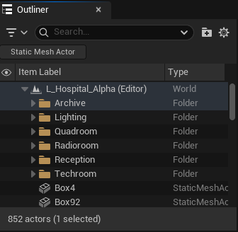  
*Figure 1: Clean layer isolation in World Outliner for source control stability and asset organization.*

---

### Spatial Evolution: Greybox Blockout vs Final Lighting Pass

Each room followed a strict level design pipeline: starting from collision-verification greyboxes to establish tight-space navigation, ending with dynamic lighting and high-density detailing.

#### 1. Prologue (Reception / Quarantine)
> The starting zone featuring a sparse "crossroads" layout. Controls conditional progression gates (locked left/right doors).

| Blockout / Spatial Test | Final Environment & Lighting |
| :---: | :---: |
| 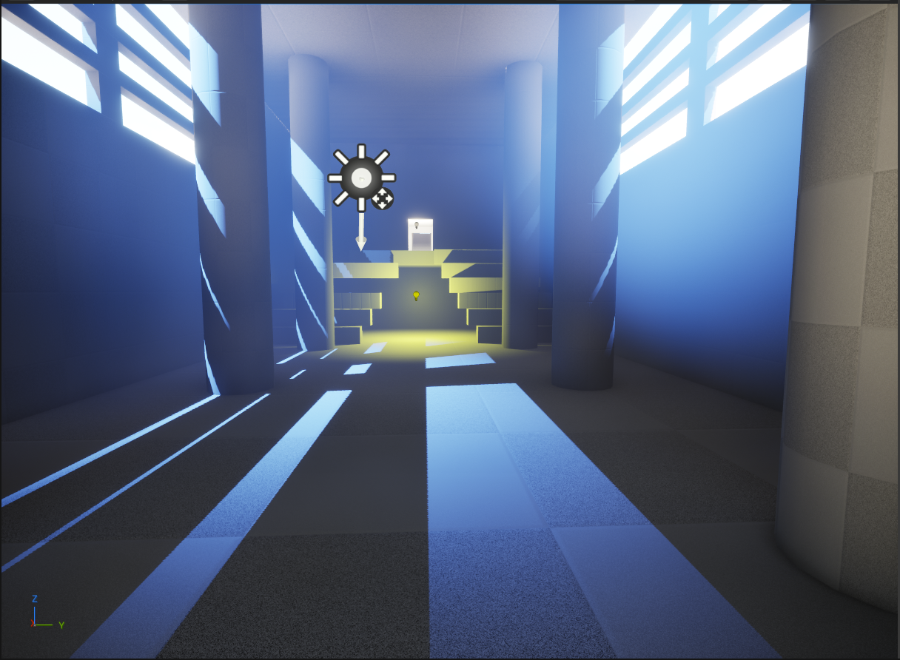 | 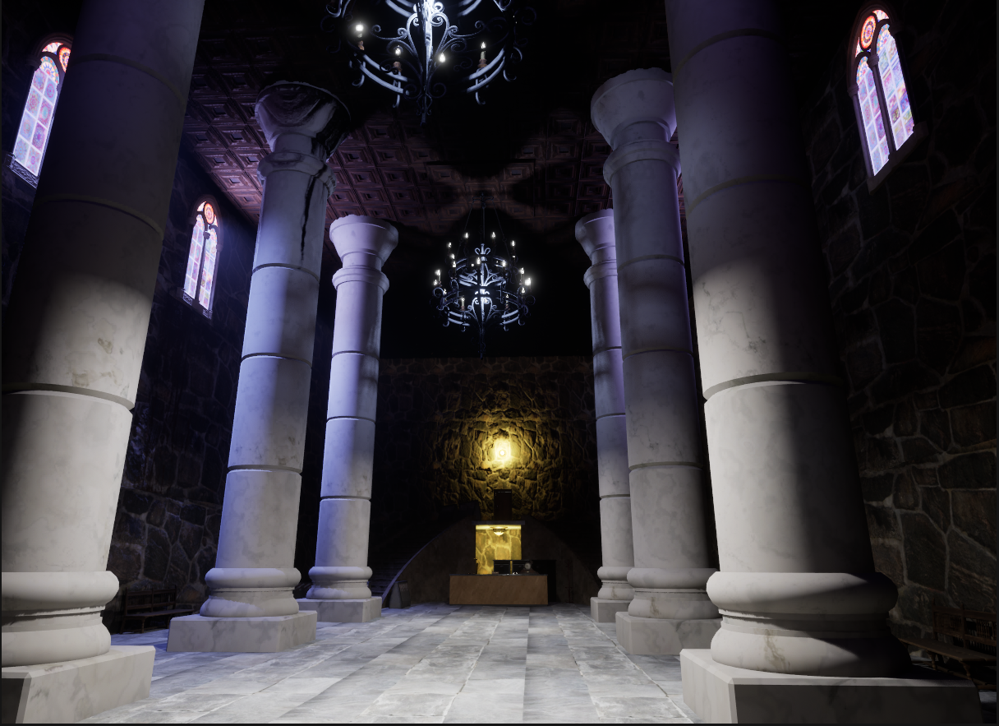 |

#### 2. Radio Room (Coastal Sea Panorama)
> A sterile, lighthouse-style sector with heavy ocean media texture rendering bound to dynamic pause/play occlusion volumes.

| Blockout / Spatial Test | Final Environment & Lighting |
| :---: | :---: |
| 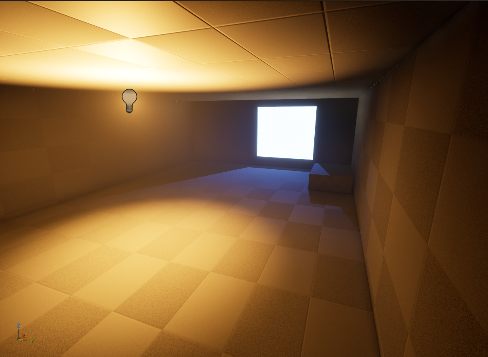 | 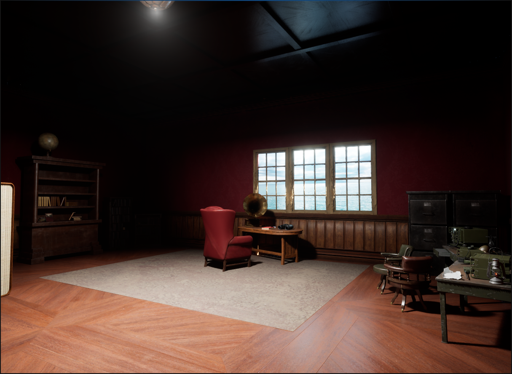 |

#### 3. Technical Node (Red Collector Zone)
> Industrial zone containing low-hanging structural metal beams used specifically for overhead Capsule Collision & LineTrace testing.

| Blockout / Spatial Test | Final Environment & Lighting |
| :---: | :---: |
| 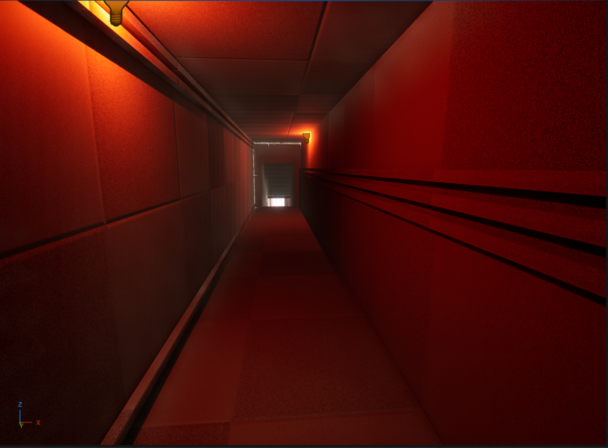 | 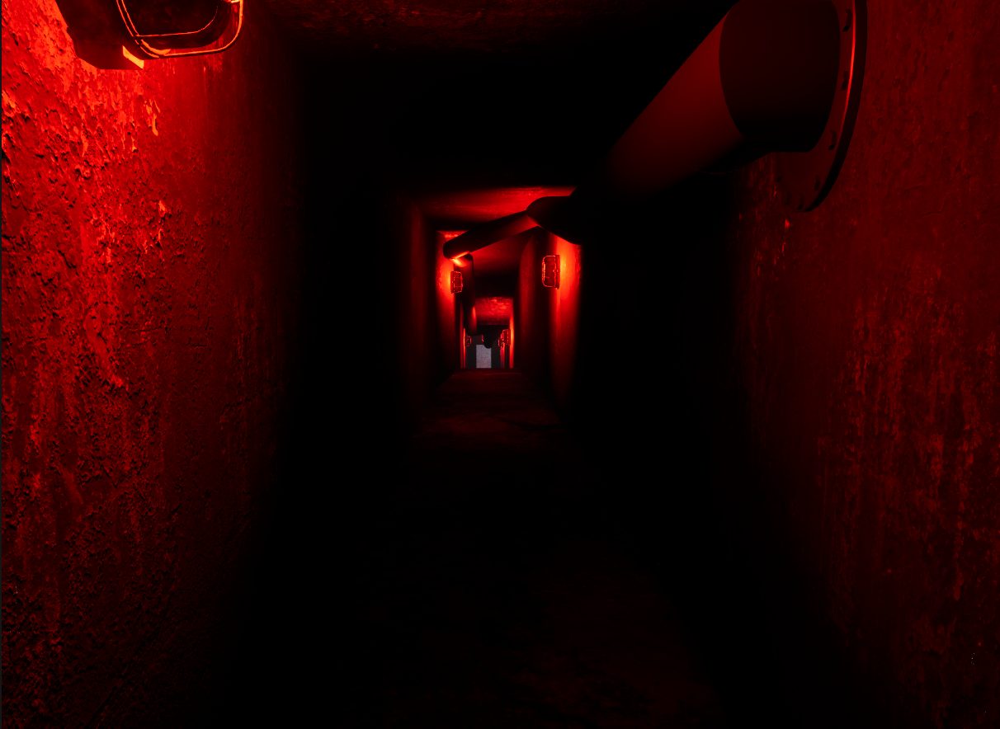 |

#### 4. Archive & Storage Room
> Labyrinthine geometry designed for navigation trapping tests and platforming mechanics.

| Blockout / Spatial Test | Final Environment & Lighting |
| :---: | :---: |
| 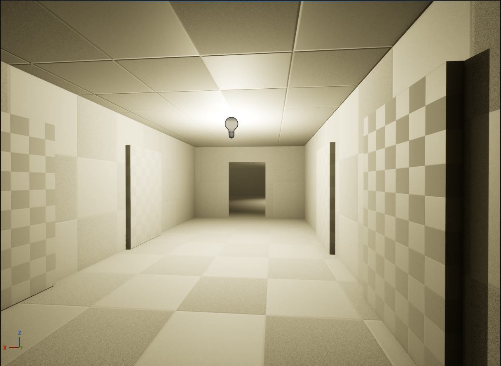 | 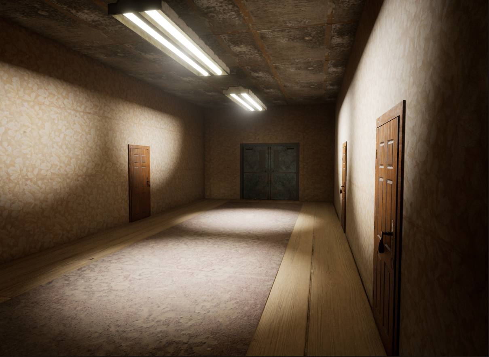 |
| 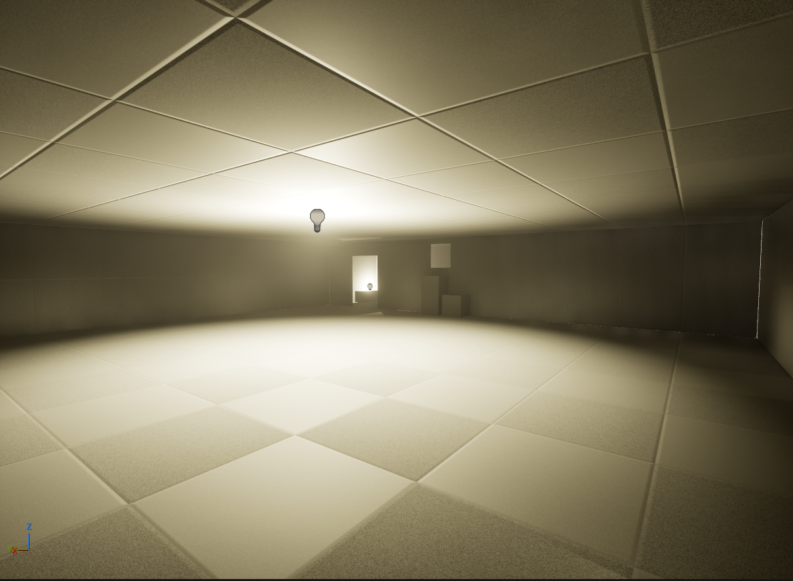 | 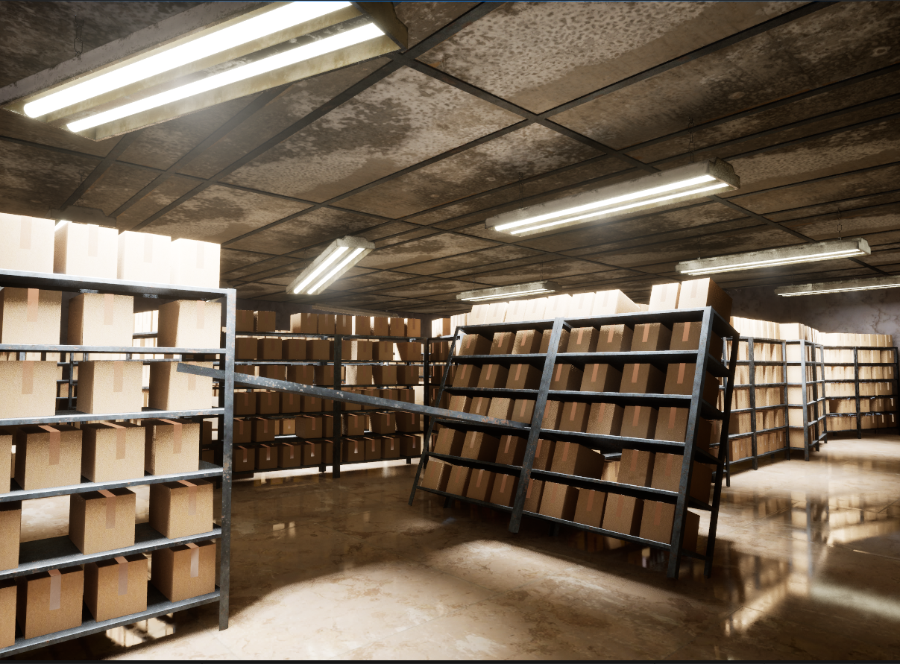 |

#### 5. Observation Room
> High-suspense final room housing interactive quest evaluation interfaces and critical scripting triggers.

| Blockout / Spatial Test | Final Environment & Lighting |
| :---: | :---: |
| 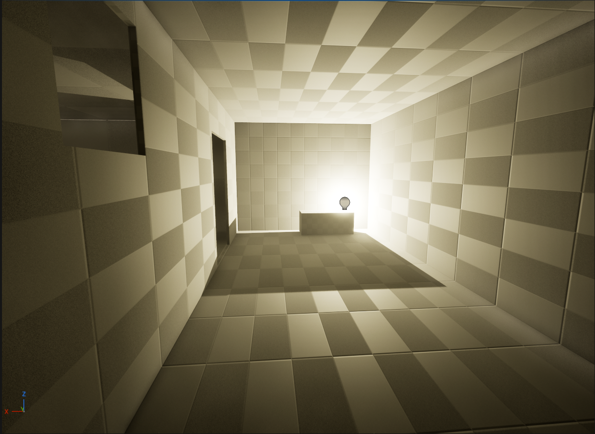 | 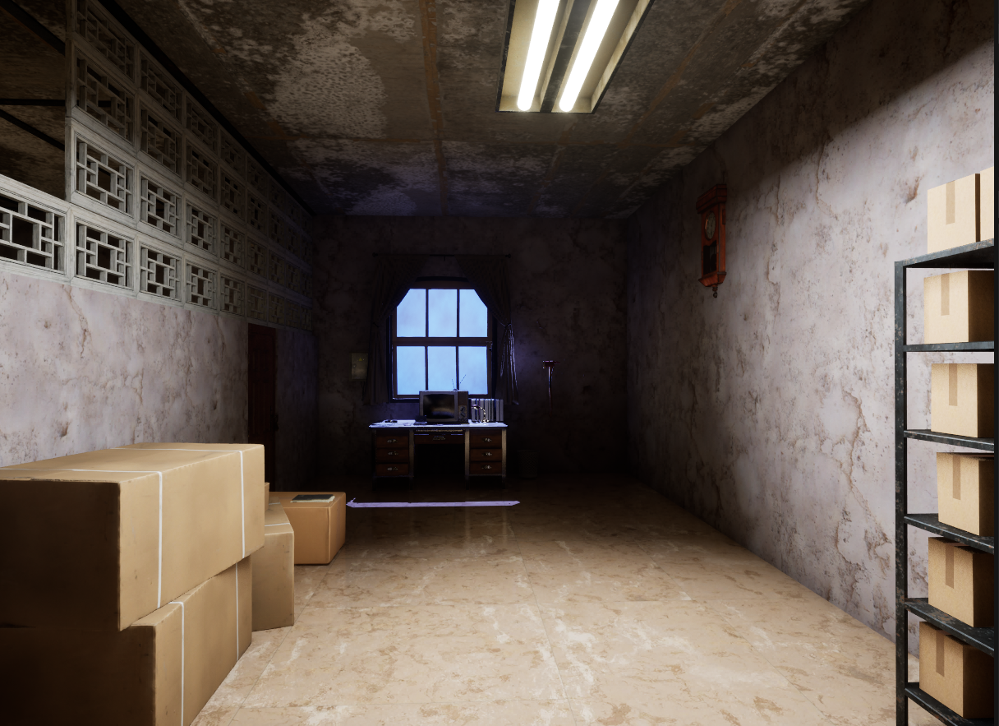 |

---

## 🛠️ Core Engineering & Implemented Systems

*(Note: All systems, blueprint logic graphs, line-traces, and interface communications are fully demonstrated in the showreel video).*

### 1. Advanced Character Controller & Collision Integrity
* **Adaptive Overhead-Aware Crouching:** Implemented a real-time `LineTraceByChannel` scanning vertically from the player's skull. If an obstacle (e.g., a low-hanging girder) is detected while the player crouches, the system clamps the capsule component deformation, physically preventing the character from standing up and clipping into geometry.
* **Navigation Trapping Verification:** Engineered layout segments requiring platforming jumps to bypass wall barriers, testing standard capsule collision responses and character traversal bounds against static environment meshes.
* **Primitive Collision Optimization:** Enforced simple primitive collision bounds (strictly Box, Sphere, or Capsule primitives) across all environment assets instead of complex mesh collisions, preventing player clipping and reducing CPU physics overhead during line trace evaluations.

### 2. Dynamic Surface-Type Audio Engine (`LineTrace` Driven)
* **Modular Surface-Recognition Audio Engine:** Optimized footstep and impact audio playback using vertical downward line-traces. Fetches hit `Physical Materials` (Wood, Metal, Concrete, Tile) to execute a randomized audio emitter node with tailored delay gates and normalized 1-second audio clip truncations, maintaining performance and audio variety.

### 3. Smart Resource Management & Render Optimization
* **Eco-Friendly Media Textures:** Heavy looping video textures simulating the ocean storm outside panoramic window frames are bound to localized volume triggers (`Box Collision`). Entering the sector triggers `Open Source`; exiting immediately triggers `Pause` to offload GPU/RAM usage when occluded.
* **Optimized Emissive & Dynamic Panner Shaders:** Engineered lightweight Substrate materials (`M_FogVolume`) driving both atmospheric fog planes and stained-glass window light emission. Utilized UV `Panner` nodes shifting texture sample masks into `Opacity Override` and `Emissive Color` channels, mimicking dynamic volumetric rays and moving mist with near-zero GPU instruction overhead.

### 4. Interactive Object-Oriented Framework & Keypad Logic
* **Interactive Object-Oriented Framework:** Deployed standard OOP principles via a master parent class (`BP_Master_Interactable`) controlling sub-child actors (`BP_Hospital_Door`, inspectable notes, keypad locks).
* **Interface-Driven Interaction System:** Integrated a decoupled Blueprint Interface (`BPI_Interaction`) for readable notes (`BP_HospitalNote`), passing raw text parameters directly to `WBP_Note_Screen_Widget` without hard character casting.
* **Numeric Keypad & Passcode Lock Logic:** Engineered a Keypad interface evaluating dynamic runtime string inputs against predefined passcode variables, executing conditional branch gates to unlock access barriers upon a correct match.

### 5. Custom QA Test Automation / Cheat DevTools
* Designed an embedded in-engine tester menu mapped to designated hotkeys to streamline regression testing and boundary verification:
  * Keys `[1-8]`: Triggers immediate, deterministic location vectors, teleporting the player pawn directly to target coordinate points across the 5 sub-rooms.
  * Key `[R]`: Triggers a swift, hard map instance reload (`Restart Level`) to instantly clear memory states and run clean-slate passes.

---

## 🐛 Documented Bug Matrix & Root Cause Analyses

Below are real technical bug reports encountered, cataloged, and resolved during the *L_Hospital_Alpha* production cycle.

### Bug ID: LE-001 | Rendering & Graphics
* **Component:** Rendering / Dynamic GI (Lumen)
* **Severity:** Medium | **Priority:** Medium
* **Title:** Light leaking visible at the joints of modular wall meshes under Lumen GI.
* **Description:** When observing corners of enclosed interior spaces, dynamic directional daylight leaks through the structural seams of modular wall pieces, breaking immersion.
* **Root Cause:** Insufficient volumetric thickness on custom asset meshes combined with ungenerated or low-resolution Mesh Distance Fields for interior modular pieces.
* **Resolution:** Increased architectural wall thickness padding to 15 units. Enabled "Generate Mesh Distance Fields" in Project Settings and expanded the "Distance Field Resolution Scale" index to 2.0 on the affected static assets.

### Bug ID: LE-002 | Audio Sequencing Flow
* **Component:** Gameplay Logic / Audio Triggers
* **Severity:** Low | **Priority:** High
* **Title:** Jumpscare audio event triggers multiple times upon repeated Box Collision overlap.
* **Description:** The structural iron-knocking scary audio event re-executes every single time a player moves across the trigger volume, provided the player maintains Key #2 state on their character.
* **Root Cause:** The execution pathway lacked an explicit execution latching gate. Because the evaluation check for the room key variable constantly passed true, the overlap event boundary fired repeatedly.
* **Resolution:** Integrated a strict `Do Once` node immediately following the conditional key variable branch, permanently closing the activation line after the initial successful overlap.

### Bug ID: LE-003 | Math Transforms & Animation
* **Component:** Interactive Actors (Doors)
* **Severity:** Medium | **Priority:** High
* **Title:** Double-wing door assets open in identical rotational vectors, causing wall/player clipping.
* **Description:** Activating double-wing doors applies an identical positive `Yaw` value from the Timeline to both door meshes. As a result, the right wing opens correctly away from the player, while the left wing rotates into the player capsule and clips into adjacent wall geometry.
* **Root Cause:** Symmetrical door wing components shared an unmodified positive Timeline float value without accounting for local transform mirror polarity.
* **Resolution:** In the double-door Blueprint logic, separated the rotational transforms. Multiplied the target `Yaw` float value by `-1` specifically for the left door wing component, ensuring both wings cleanly swing in the same unified direction (away from the player).

### Bug ID: LE-004 | Object References & Interfaces
* **Component:** Interaction Framework
* **Severity:** High | **Priority:** High
* **Title:** Direct Blueprint casting in readable notes creates tight coupling and breaks UI input mode logic.
* **Description:** Attempting to open readable notes (`BP_HospitalNote`) directly cast to `BP_FirstPersonCharacter` to pause character inputs and spawn `WBP_Note_Screen_Widget`. This approach caused null-pointer warnings, fragile hard dependencies, and unstable mouse cursor focus states (`Game and UI` mode lockup).
* **Root Cause:** Direct character casting created unnecessary hard object dependencies and coupled independent UI presentation logic with character execution flows.
* **Resolution:** Refactored the interactable note logic to communicate strictly via a Blueprint Interface (`BPI_Interaction`). Interacting with a note fires an interface message to push raw text/texture parameters to `WBP_Note_Screen_Widget`, decoupling UI focus execution from hard character dependencies.

### Bug ID: LE-005 | Physics Simulation vs Deterministic Design (Architecture Flaw)
* **Component:** Physics / Collision Constraints
* **Severity:** High | **Priority:** High
* **Title:** Physics-driven doors cause extreme capsule clipping and player collision instability.
* **Description:** Utilizing skeletal forces and physics boundaries on door frames resulted in erratic object jittering. Sprinting or crouching while interacting frequently broke character navigation bounds, trapping the capsule in adjacent walls. Sound cues also failed due to volatile physics sleep states.
* **Root Cause:** Physics solver instability under high-velocity character collision intersections.
* **Resolution:** **Architectural Decision:** Deprecated physics simulation weights entirely for mechanical level barriers. Re-engineered the system to rely on stable, deterministic design paradigms: a precise box trigger registers interface inputs, and a predictable `Timeline` node explicitly shifts local rotation vectors, ensuring total stability and reliable audio end-state hooks.

---

## 🔗 Project Links & Contacts

* **Gameplay & Blueprints Showreel:** [Watch Video on Google Drive][SHOWREEL_LINK]
* **GitHub Repository:** [MakarenkoDmytro03 on GitHub](https://github.com/MakarenkoDmytro03)
* **LinkedIn Profile:** [Dmytro Makarenko on LinkedIn](https://www.linkedin.com/in/dmytro-makarenko-929794421/)

[SHOWREEL_LINK]: https://drive.google.com/file/d/1GnL4LYxAbtm37JVKoWMgnCmxz-X2LwxT/view?usp=drive_link
